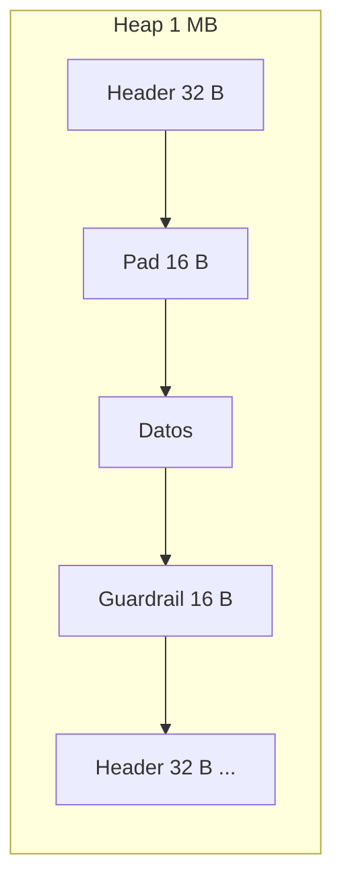
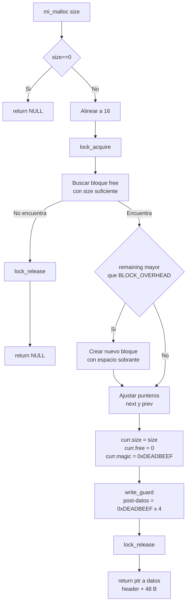
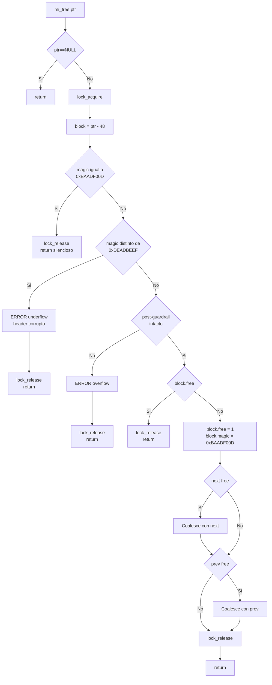
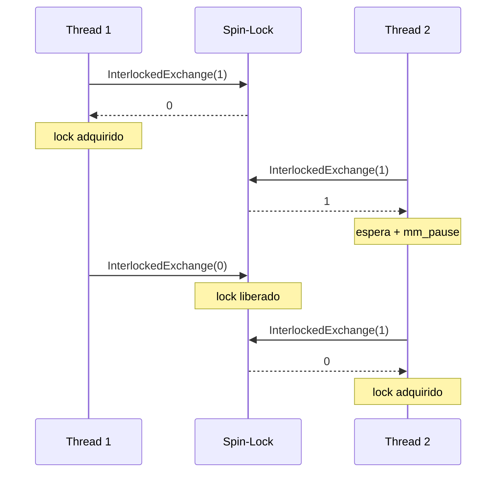
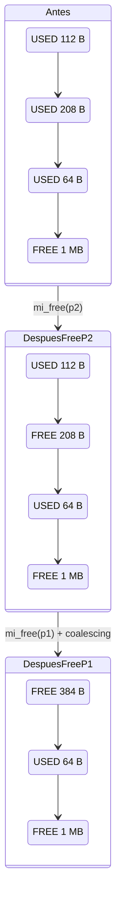

# Asignador de Memoria — `mi_malloc` / `mi_free`

Librería C que gestiona un bloque estático de 1 MB usando lista enlazada de metadatos, First-Fit, coalescing, spin-lock, alineación a 16 bytes y guardrails 0xDEADBEEF.

---

## Layout de un Bloque Ocupado



```
0x00  Block_t.size            8 B
0x08  Block_t.free            4 B
0x0C  Block_t.magic=0xDEADBEEF 4 B
0x10  Block_t.next            8 B
0x18  Block_t.prev            8 B
                           ───────── 32 B (header)
0x20  Padding                 16 B
                           ───────── 48 B hasta datos
0x30  Datos del usuario       size
0x30+size  Guardrail post     16 B  = 0xDEADBEEF x 4
                           ───────── size + 64 B overhead
```

## API

```c
void mi_init(void);
void *mi_malloc(size_t size);
void mi_free(void *ptr);
void mi_print_stats(void);   // solo con -DMYALLOC_DEBUG
```

## Flujo mi_malloc



## Flujo mi_free



## Thread-Safety



## Coalescing



## Deteccion de Errores

| Escenario | Deteccion | Output |
|-----------|-----------|--------|
| Buffer overflow | Post-guardrail corrupto | `ERROR: Buffer overflow detectado` |
| Buffer underflow | Header magic cambiado | `ERROR: Buffer underflow... magic=0xFFFFFFFF` |
| Double-free | magic = 0xBAADF00D | Silencioso, no-op |

## Integracion como Libreria

Tres niveles de integracion:

### Nivel A — Codigo Fuente
Compilas `myalloc.c` junto con tu programa. Simple pero poco escalable.
```bash
cl.exe /std:c11 /Fe:programa.exe programa.c myalloc.c
```

### Nivel B — Libreria Estatica (.lib)  ← RECOMENDADO
Compilas `myalloc.c` una vez y generas un `.lib`. Tu programa solo necesita `myalloc.h` + `myalloc.lib`.
```bash
# Generar la libreria
cl.exe /std:c11 /c myalloc.c
lib.exe /out:myalloc.lib myalloc.obj

# Usarla en tu programa
cl.exe /std:c11 /Fe:programa.exe programa.c myalloc.lib
```

Ventajas: un solo `.exe` autocontenido, compilacion rapida, distribucion simple.

### Nivel C — Libreria Dinamica (.dll)
`myalloc.dll` se carga en RAM cuando el sistema operativo lo pide. Si mejoras el algoritmo, solo reemplazas el `.dll`.
```bash
cl.exe /std:c11 /LD /Fe:myalloc.dll myalloc.c
cl.exe /std:c11 /Fe:programa.exe programa.c myalloc.lib
```

### Build Script
```bash
cd "Project v1"
build.bat
```

Genera:
- `myalloc.lib` — libreria estatica (release)
- `myalloc_dbg.lib` — libreria estatica (debug, con `mi_print_stats`)
- `allocator.exe` — test suite (20 tests)
- `example.exe` — programa de ejemplo

## Tests

| Test | Descripcion | Estado |
|------|-------------|--------|
| 1 | Asignaciones + alineacion 16 B | OK |
| 2 | Coalescing | OK |
| 3 | Fragmentacion + First-Fit | OK |
| 4 | Large alloc 512KB + fallo | OK |
| 5 | Free all | OK |
| 6 | Double-free | OK |
| 7 | Buffer overflow detection | OK |
| 8 | Header corruption detection | OK |

```bash
cd "Project v1"
build.bat           # Build completo + tests
.\allocator.exe     # 20/20 tests
.\example.exe       # Ejemplo de integracion